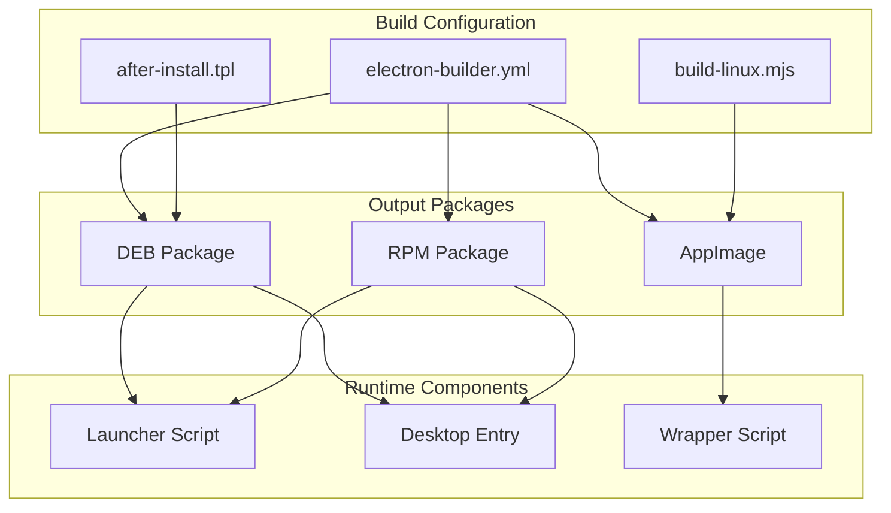

# Design Document: Linux Package Rebuild

## Overview

本设计文档描述了如何重构 TabShell 应用的 Linux 包（RPM、DEB、AppImage）构建配置，以确保：
1. 所有依赖项完整包含
2. 构建后软件包的启动方式与 `npm start` 参数一致

核心目标是让生产环境的启动参数与开发环境保持一致：
- `--no-sandbox` - 禁用 Chromium 沙箱
- `--disable-dev-shm-usage` - 禁用 /dev/shm 使用
- `--disable-gpu` - 禁用 GPU 加速

## Architecture



## Components and Interfaces

### 1. electron-builder.yml 配置

主要修改点：

#### 1.1 Linux executableArgs 配置
```yaml
linux:
  category: "Utility;TerminalEmulator;System"
  icon: "./build/icons"
  artifactName: tabshell-${version}-linux-${env.ARCH}.${ext}
  executableArgs:
    - "--no-sandbox"
    - "--disable-dev-shm-usage"
    - "--disable-gpu"
  desktop:
    entry:
      StartupWMClass: tabshell
```

#### 1.2 DEB 依赖配置
```yaml
deb:
  depends:
    # 核心依赖
    - libnotify4
    - libsecret-1-0
    - libxtst6
    - libnss3
    - libgtk-3-0
    - libxss1
    - xdg-utils
    - libatspi2.0-0
    - libuuid1
    - gnome-keyring
    # 音频支持
    - libasound2
    # GPU 和显示
    - libgbm1
    - libdrm2
    - libxkbcommon0
    - libxrandr2
    - libxcomposite1
    - libxdamage1
    - libxfixes3
    # 打印支持
    - libcups2
  recommends:
  afterInstall: build/linux/after-install.tpl
  fpm:
    - '--replaces'
    - 'tabby'
```

#### 1.3 RPM 依赖配置
```yaml
rpm:
  depends:
    # 核心依赖
    - gnome-keyring
    - libsecret
    - libnotify
    - libXtst
    - nss
    - gtk3
    - libXScrnSaver
    - xdg-utils
    - at-spi2-atk
    - libuuid
    # 音频支持
    - alsa-lib
    # GPU 和显示
    - mesa-libgbm
    - libdrm
    - libxkbcommon
    - libXrandr
    - libXcomposite
    - libXdamage
    - libXfixes
    # 打印支持
    - cups-libs
  fpm:
    - '--rpm-rpmbuild-define'
    - '_build_id_links none'
    - '--replaces'
    - 'tabby'
```

### 2. after-install.tpl 脚本

更新后的安装后脚本：

```bash
#!/bin/bash
cat > '/usr/bin/${executable}' << 'END'
#!/bin/sh
exec '/opt/${productFilename}/${executable}' --no-sandbox --disable-dev-shm-usage --disable-gpu "$@"
END

chmod +x '/usr/bin/${executable}'
```

关键改进：
- 添加 `--disable-dev-shm-usage` 参数
- 添加 `--disable-gpu` 参数
- 使用 `exec` 替换当前进程
- 使用 `"$@"` 正确传递用户参数

### 3. build-linux.mjs 脚本

#### 3.1 afterPack 钩子中的启动脚本

```javascript
fs.writeFileSync(exePath, `#!/bin/sh
DIR="$(CDPATH= cd -- "$(dirname -- "$0")" && pwd)"
export ELECTRON_DISABLE_SANDBOX=1
export LD_LIBRARY_PATH="$DIR\${LD_LIBRARY_PATH:+:$LD_LIBRARY_PATH}"
if [ -f "$DIR/libfuse.so.2" ]; then
  export APPIMAGE_FUSE_LIBRARY="$DIR/libfuse.so.2"
fi
exec "$DIR/${exeName}-bin" --no-sandbox --disable-dev-shm-usage --disable-gpu "$@"
`)
```

#### 3.2 AppImage wrapper 脚本

```javascript
fs.writeFileSync(wrapperPath, `#!/bin/sh
set -e
DIR="$(CDPATH= cd -- "$(dirname -- "$0")" && pwd)"
APPIMAGE="$DIR/${path.basename(appImagePath)}"
if [ -f "$DIR/libfuse.so.2" ]; then
  export LD_LIBRARY_PATH="$DIR\${LD_LIBRARY_PATH:+:$LD_LIBRARY_PATH}"
  export APPIMAGE_FUSE_LIBRARY="$DIR/libfuse.so.2"
fi
export ELECTRON_DISABLE_SANDBOX=1
exec "$APPIMAGE" --no-sandbox --disable-dev-shm-usage --disable-gpu "$@"
`)
```

#### 3.3 构建目标配置

```javascript
builder({
    dir: true,
    linux: ['deb', 'rpm', 'AppImage'],  // 添加 rpm
    armv7l: process.env.ARCH === 'armv7l',
    arm64: process.env.ARCH === 'arm64',
    // ...
})
```

## Data Models

### 启动参数配置

| 参数 | 用途 | 必需 |
|------|------|------|
| `--no-sandbox` | 禁用 Chromium 沙箱，避免权限问题 | 是 |
| `--disable-dev-shm-usage` | 禁用 /dev/shm，避免共享内存不足 | 是 |
| `--disable-gpu` | 禁用 GPU 加速，提高兼容性 | 是 |

### 依赖映射表

| 功能 | DEB 包名 | RPM 包名 |
|------|----------|----------|
| 通知 | libnotify4 | libnotify |
| 密钥存储 | libsecret-1-0 | libsecret |
| 测试扩展 | libxtst6 | libXtst |
| 网络安全 | libnss3 | nss |
| GTK | libgtk-3-0 | gtk3 |
| 屏幕保护 | libxss1 | libXScrnSaver |
| 桌面工具 | xdg-utils | xdg-utils |
| 辅助功能 | libatspi2.0-0 | at-spi2-atk |
| UUID | libuuid1 | libuuid |
| 密钥环 | gnome-keyring | gnome-keyring |
| 音频 | libasound2 | alsa-lib |
| GPU 缓冲 | libgbm1 | mesa-libgbm |
| DRM | libdrm2 | libdrm |
| 键盘 | libxkbcommon0 | libxkbcommon |
| 显示配置 | libxrandr2 | libXrandr |
| 合成 | libxcomposite1 | libXcomposite |
| 损坏跟踪 | libxdamage1 | libXdamage |
| X 修复 | libxfixes3 | libXfixes |
| 打印 | libcups2 | cups-libs |

## Correctness Properties

*A property is a characteristic or behavior that should hold true across all valid executions of a system-essentially, a formal statement about what the system should do. Properties serve as the bridge between human-readable specifications and machine-verifiable correctness guarantees.*

### Property 1: Launcher Configuration Contains Required Parameters

*For any* launcher script or configuration file generated by the build system, it SHALL contain all three required startup parameters: `--no-sandbox`, `--disable-dev-shm-usage`, and `--disable-gpu`.

**Validates: Requirements 1.1, 1.2, 1.3, 5.2, 5.3, 5.4**

### Property 2: DEB Package Declares All Required Dependencies

*For any* DEB package configuration, the `depends` array SHALL contain all 19 required dependencies as specified in the requirements.

**Validates: Requirements 2.1-2.19**

### Property 3: RPM Package Declares All Required Dependencies

*For any* RPM package configuration, the `depends` array SHALL contain all 19 required dependencies as specified in the requirements.

**Validates: Requirements 3.1-3.19**

### Property 4: AppImage Wrapper Script Configuration

*For any* AppImage wrapper script generated by the build system, it SHALL:
- Set `LD_LIBRARY_PATH` to include the script's directory
- Set `ELECTRON_DISABLE_SANDBOX=1` environment variable
- Pass all three required startup parameters to the AppImage executable
- Pass user-provided arguments via `"$@"`

**Validates: Requirements 4.2, 4.3, 4.4**

### Property 5: After-Install Script Parameter Passthrough

*For any* after-install launcher script, it SHALL pass all user-provided command-line arguments to the application using `"$@"` or equivalent.

**Validates: Requirements 5.5**

### Property 6: executableArgs Configuration

*For any* electron-builder.yml configuration, the `linux.executableArgs` array SHALL contain all three required startup parameters.

**Validates: Requirements 6.1, 6.2, 6.3**

## Error Handling

### 构建错误处理

1. **依赖缺失**: 如果系统缺少构建工具（如 patchelf），构建脚本应输出警告但继续执行
2. **libfuse 缺失**: 如果找不到 libfuse.so.2，AppImage 仍可构建，但会输出警告
3. **权限问题**: chrome-sandbox 权限设置失败时应捕获异常并继续

### 运行时错误处理

1. **沙箱禁用**: 通过 `--no-sandbox` 和 `ELECTRON_DISABLE_SANDBOX=1` 双重保障
2. **共享内存**: 通过 `--disable-dev-shm-usage` 避免 /dev/shm 空间不足问题
3. **GPU 兼容性**: 通过 `--disable-gpu` 避免 GPU 驱动兼容性问题

## Testing Strategy

### 单元测试

1. **配置文件验证**: 验证 electron-builder.yml 包含所有必需的依赖和参数
2. **脚本内容验证**: 验证 after-install.tpl 包含正确的启动参数
3. **构建脚本验证**: 验证 build-linux.mjs 生成正确的 wrapper 脚本

### 属性测试

使用 TypeScript 和 fast-check 进行属性测试：

1. **Property 1**: 验证所有启动器配置包含必需参数
2. **Property 2**: 验证 DEB 依赖完整性
3. **Property 3**: 验证 RPM 依赖完整性
4. **Property 4**: 验证 AppImage wrapper 脚本配置
5. **Property 5**: 验证参数传递
6. **Property 6**: 验证 executableArgs 配置

### 集成测试

1. **构建测试**: 执行完整构建流程，验证三种包格式都能成功生成
2. **安装测试**: 在 Docker 容器中测试 DEB/RPM 包安装
3. **启动测试**: 验证安装后的应用能正确启动
